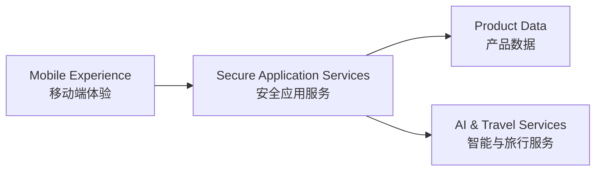

# GoNow 寻迹

> 让每次出发都有迹可循 / Never lose track of your journey.

GoNow 寻迹是一款面向旅行全生命周期的智能应用，覆盖目的地发现、行程规划、旅途中协作、旅行手账、费用结算与足迹沉淀。

本仓库仅用于产品展示。源代码、系统提示词、数据结构、服务接口、算法实现、测试、部署与运维资料均未公开。

## 产品能力

- 智能目的地发现与行程规划
- 地图化行程管理与多人协作
- 旅行手账与照片故事
- 旅行费用记录与协作结算
- 中国及世界旅行足迹

## 产品预览

### 目的地发现

### 旅行信息

### 地图行程

### 旅行手账

### 旅行账本与足迹

## 高层架构

架构说明仅展示职责边界，不代表公开具体实现、接口、策略或算法。

## 商务合作与内测

- WeChat: `tu07918382691`
- Email: [tu07918382691@gmail.com](mailto:tu07918382691@gmail.com)

## 权利声明

Copyright © GoNow. All Rights Reserved.

未经权利人事先书面许可，不得复制、修改、分发、再许可、商业使用本仓库中的文字、图像、品牌素材、产品设计或其他内容。详见 [LICENSE.md](LICENSE.md)。
